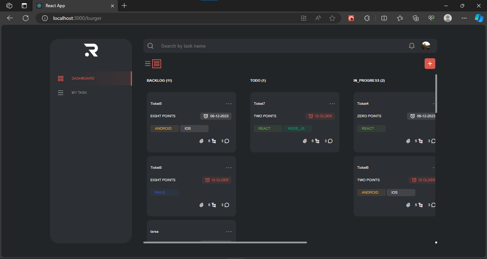
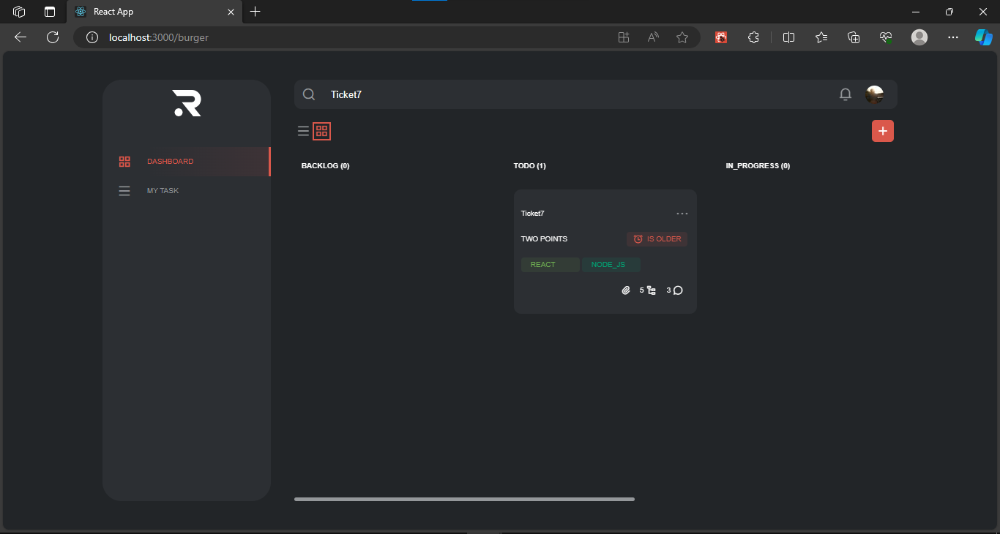
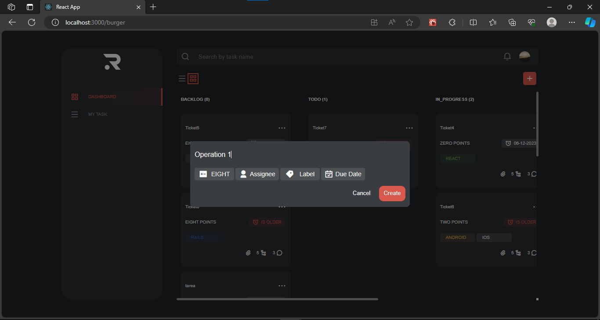
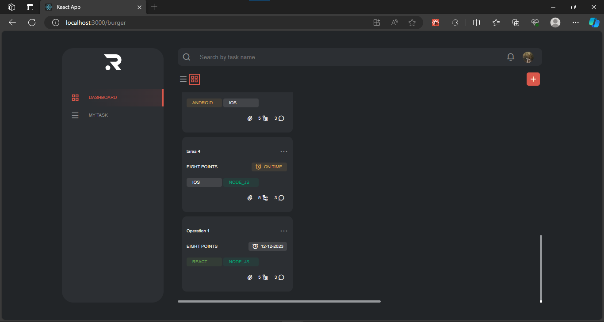
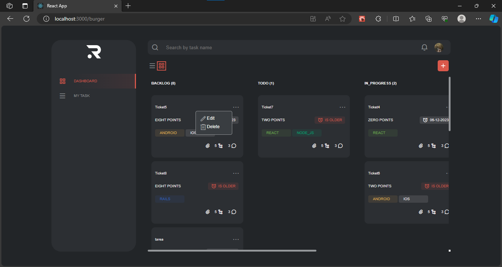

RAVN Challenge - Task Management App
Welcome to the RAVN Challenge Task Management App! This application provides an intuitive experience for efficiently exploring and adding tasks. The interface looks amazing, and integration with the provided API ensures seamless communication for retrieving and updating task information.

*Setup and Execution Instructions*

Clone the Repository:
### git clone https://github.com/brenpc1443/RAVN_CHALLENGE.git
### cd RAVN_CHALLENGE

Install Dependencies:
### npm install

Run the Application:
### npm start

The application will be available at http://localhost:3000.

*Project Description*
The Task Management application is designed to simplify daily task management. Users can efficiently explore and add tasks through an intuitive interface. The application follows best software design practices, keeping the codebase clean and modular.

Key Features:
Efficient exploration and visualization of tasks.
Adding tasks with details such as title and due date.
Seamless communication with the API to retrieve and update information.

*Project Structure*
The project follows the following folder structure:

-app: Contains the main logic of the application.
-components: Reusable components used throughout the application.
-pages: Main pages of the application.
-shared:
  --assets: Multimedia resources and static files.
  --context: Application contexts for state management.
  --routes: Application route configuration.
  --services: Services for communication with the API.
  --types: TypeScript types and interfaces used in the project.
  --utils: Shared utility functions.
-styles: Global styles and files related to appearance.
-ui: Specific user interface components.

This structure was chosen to organize the code clearly and modularly.

*Technologies/Libraries Used*
apollo-client: Used to interact with GraphQL servers.
graphql: Query language used to define data structure.
react: Primary library for building the user interface.
react-dom: DOM manipulation for React applications.
react-router-dom: Routing for React applications.
styled-components: Library for styling React components.
typescript: JavaScript extension adding static types.

*Screenshots of the working application*

These technologies were chosen for compatibility, popularity, and efficiency in development.

*Additional Information*
⚠️ Important: The project did not finish as expected, and some features may not work as originally planned. We appreciate your understanding and are working to improve and complete the application.

The application is ready to simplify your task management! If you have any questions or encounter any issues, feel free to contact us. We hope you enjoy using RAVN Challenge!
